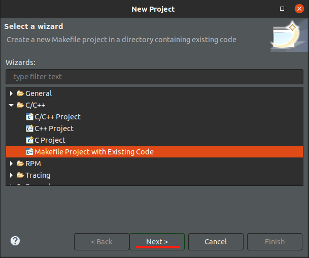

<!-- START doctoc generated TOC please keep comment here to allow auto update -->
<!-- DON'T EDIT THIS SECTION, INSTEAD RE-RUN doctoc TO UPDATE -->
**Table of Contents**  *generated with [DocToc](https://github.com/thlorenz/doctoc)*

- [介绍](#%E4%BB%8B%E7%BB%8D)
- [Todo](#todo)
- [目录说明](#%E7%9B%AE%E5%BD%95%E8%AF%B4%E6%98%8E)
  - [arm32](#arm32)
    - [1. 示例hello](#1-%E7%A4%BA%E4%BE%8Bhello)
    - [2. 示例libgcc](#2-%E7%A4%BA%E4%BE%8Blibgcc)
    - [3. 示例mmu](#3-%E7%A4%BA%E4%BE%8Bmmu)
  - [arm64](#arm64)
    - [1. 示例hello](#1-%E7%A4%BA%E4%BE%8Bhello-1)
  - [cortex-m](#cortex-m)
    - [1. 示例hello](#1-%E7%A4%BA%E4%BE%8Bhello-2)
- [运行示例](#%E8%BF%90%E8%A1%8C%E7%A4%BA%E4%BE%8B)
- [调试](#%E8%B0%83%E8%AF%95)
  - [直接使用gdb调试](#%E7%9B%B4%E6%8E%A5%E4%BD%BF%E7%94%A8gdb%E8%B0%83%E8%AF%95)
  - [使用vscode调试](#%E4%BD%BF%E7%94%A8vscode%E8%B0%83%E8%AF%95)
  - [使用eclipse调试](#%E4%BD%BF%E7%94%A8eclipse%E8%B0%83%E8%AF%95)
- [问题记录](#%E9%97%AE%E9%A2%98%E8%AE%B0%E5%BD%95)
  - [immediate value out of range](#immediate-value-out-of-range)
- [wiki中关于cortex-m](#wiki%E4%B8%AD%E5%85%B3%E4%BA%8Ecortex-m)

<!-- END doctoc generated TOC please keep comment here to allow auto update -->

## 介绍

尝试在arm32/arm64/cortex-m/riscv64上学习一些裸板编程

## Todo

arm32/mmu
arm64/mmu
cortex-m/hello
riscv/mmu

## 目录说明

### arm32
编译选项

```
-mthumb -mcpu=cortex-a7
```

qemu

```
qemu-system-arm -M virt -cpu cortex-a7
```

#### 1. 示例hello
实现汇编代码初始化c语言运行环境的示例
".data"段的加载地址指向__etext，将".data"的数据放置在".text"段的后面，同时实现DATA_COPY，在启动时拷贝__etext起始的数据到".data"中，这种".data"的链接地址和加载地址不同的做法通常是在嵌入式MCU中比较常用，由于芯片只能在rom或flash中保存代码，".data"段中的初始值也必须保存在rom或flash中，所以".data"加载地址通常放在".text"段末尾。
还实现了ZERO_SET用于".bss"段初始化。
#### 2. 示例libgcc
测试不加如下选项，生成的elf文件的差异
```
# CFLAGS += -fno-builtin -ffreestanding
# LDFLAGS += -nostdlib
# LDFLAGS += -L/Users/starot/bin/gcc-arm-none-eabi-10.3-2021.10/lib/gcc/arm-none-eabi/10.3.1/ -lgcc 
```

#### 3. 示例mmu

未完成

### arm64

编译选项

```
-march=armv8-a -mcpu=cortex-a57
```

qemu

```
qemu-system-aarch64 -M virt -cpu cortex-a57
```
#### 1. 示例hello
简单的串口串口打印示例

### cortex-m

编译选项

```
-march=armv7-m -mcpu=cortex-m3
```

qemu

```
qemu-system-arm -M lm3s6965evb -cpu cortex-m3
```

#### 1. 示例hello

未完成

## 运行示例

进入相应子目录会看到如下目录结构

```
$ tree
.
├── link.ld
├── Makefile
├── README.md
└── src
    ├── xxx.S
    ├── xxx.h
    └── xxx.c
```
执行make qemu命令可以运行示例代码，退出qemu，先同时按ctrl+a然后松开之后按下x键。
## 调试
以riscv/yield为例
### 直接使用gdb调试
使用xxx-none-gnu-gdb或安装gdb-multiarch

在第一个终端里运行
```
make qemu-gdb
```
启动第二个中断运行
```
gdb-multiarch -tui -q -iex "set auto-load safe-path ./"
```

### 使用vscode调试
使用xxx-none-gnu-gdb或安装gdb-multiarch，下载vscode，安装native-debug插件(C/C++插件的调试没有成功)

1. 在示例目录下新建.vscode文件夹
2. 在.vscode文件夹新建launch.json文件，内容参考如下

```
{
    "configurations": [
        {
            "name": "(native-debug) Attach to gdbserver",
            "type": "gdb",
            "request": "attach",
            "executable": "${workspaceFolder}/build/main.elf",
            "target": "127.0.0.1:26000",
            "remote": true,
            "cwd": "${workspaceFolder}",
            "gdbpath": "/usr/bin/gdb-multiarch",
            "debugger_args": [

            ],
            "valuesFormatting": "parseText"
        },
    ]
}

```
3. 在终端中运行
```
make qemu-gdb
```
4. vscode中先在汇编代码中添加断点（也可以先不加断点），点击Run->Start Debugging开启调试

### 使用eclipse调试
使用xxx-none-gnu-gdb或安装gdb-multiarch，下载Eclipse IDE for Embedded C/C++ Developers
1. 先在终端中执行"make qemu-gdb"
2. 点击File->New->Project
3. 选择Makefile Project with Existing Code，点击Next

4. 点击Browse选择示例目录，点击Finish

5. 点击Run->Debug Configurations，双击C/C++ Attach to Application会新建一个配置，可以根据需要重名

6. 选择刚刚新建的配置，点击左侧Main选项卡，Project中点击Browse选择刚刚创建的工程yield，C/C++ Application中点击Browse选择make生成的main.elf文件。Build（if required）before launching选择Disable auto build

7. 选择Debugger选项卡，选择gdbserver，下面的Main选项卡参照图片，GDB debugger填入
gdb-multiarch -ex "set architecture riscv:rv64" -ex "file build/main.elf"，同时GDB command file删除里面的内容

8. Debugger选项卡，下面Connect选项卡，Type选择TCP，Port number选择26000

9. Common选项卡，Save as选择Shared file

10. 点击Apply，然后点击Debug（可以在Debug前先设置一个断点）。

## 问题记录

### immediate value out of range
gcc使用选项"-march=armv7-m -mcpu=cortex-m3"编译如下代码
```
    LDR r0, =stack_bottom
    ADD r0, r0, #1024
```
出现错误
```
src/start.S:4: Error: immediate value out of range
```
这是因为thumb-2模式中add立即数的范围是-255 到 +255

修改为如下代码即可
```
    LDR r0, =stack_bottom
    LDR r1, =1024
    ADD r0, r0, r1
```

## wiki中关于cortex-m

Cortex-M0 / M0+ / M1实现的是ARMv6-M架构[2]，Cortex-M3实现的是ARMv7-M架构[3]，Cortex-M4 / Cortex-M7实现的是ARMv7E-M架构[3]。Cortex-M23 / M33 / M35P实现的是ARMv8-M架构[15]，Cortex-M55实现的是ARMv8.1-M架构[16]。这些架构是二进制的脚本，可以和ARMv6-M、 ARMv7-M、ARMv7E-M向上兼容。Cortex-M0 / Cortex-M0+ / Cortex-M1的脚本不用修改就可以在Cortex-M3 / Cortex-M4 / Cortex-M7上执行。Cortex-M3上可以执行的二进制代码不需修改就可以在Cortex-M4 / Cortex-M7 / Cortex-M33 / Cortex-M35P上执行[2][3]。Cortex-M架构中支持Thumb-1和Thumb-2的指令集，不支持早期的32-bit ARM指令集。

所有Cortex-M的核心都有一个共通的指令子集，包括大部分Thumb-1指令、一些Thumb-2指令，以及结果为32位的乘法。Cortex-M0 / Cortex-M0+ / Cortex-M1 / Cortex-M23设计目的就是希望让硅晶面积最小，因此其指令集也是Cortex-M家族中最少的。

Cortex-M0 / M0+ / M1中有Thumb-1指令，不过没有ARMv7-M架构才加入的指令（CBZ, CBNZ, IT）。Cortex-M0 / M0+ / M1包括一小部分的Thumb-2指令（BL, DMB, DSB, ISB, MRS, MSR）。Cortex-M3 / M4 / M7 / M33 / M35P 有所有基本的Thumb-1和Thumb-2指令。Cortex-M3加上了三个Thumb-1指令、所有的Thumb-2指令、硬件的整体除法、以及饱和运算指令。Cortex-M4加上了数字信号处理（DSP）指令，以及可选的单精度浮点运算器（VFPv4-SP）。Cortex-M7加上了可选的双精度浮点运算器（VFPv5）[2][3]。Cortex-M23 / M33加上了TrustZone指令。
